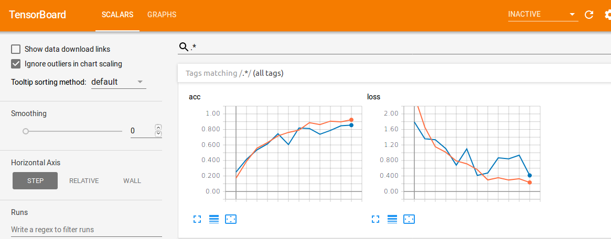

# Seeing the World

The goal is to build open source image recognition model to complement [Microsoft's Seeing AI app](https://www.microsoft.com/en-us/seeing-ai) to help the visually impaired and the blind people. We will contribute back all the models back to Seeing AI.

According to WHO, there are 253 million people live with vision impairment. 217 million have moderate to severe vision impairment and 36 million are blind. 81% of people who are blind or have moderate or severe vision impairment are aged 50 years and above.

We will start with building model to recognize fruit and vegetable in Farmer Market and expand to other settings.

We encourage our members and public to take pictures of different fruit and vegetable whenever they go to Farmer Market and commit back to the repo. We will build model using these pictures.


### Usage

**Config File**
```
{
    "size"  :    [224,224], # Net input size
    "path"  :    "data/farmer_market", # path to data
    "train" :    {

        "batch_size"    : 16, # net batch size
        "num_per_class" : [120, 30], # number of augmented examples per class
        "lr"            :   0.0002, # learning rate
        "epochs"        :   100, # number of epochs
        "split"         :   0.75  # train/validate split %
    }
}
```

**Train**
```
./stw.py train
```
Then running `tensorboard --logdir=/logs/run_{}` and entering on a browser `http://localhost:6006/` will allow for training visualization.

<p align="center">

</p>


**Inference**

```
./stw.py plots/prova.jpg -m logs/run_0/trained_model.h5
```
Will output e.g.: `Prediction: green_bean (69.97%)`.


### Project Advisors:
Jigar Doshi from CrowdAI


